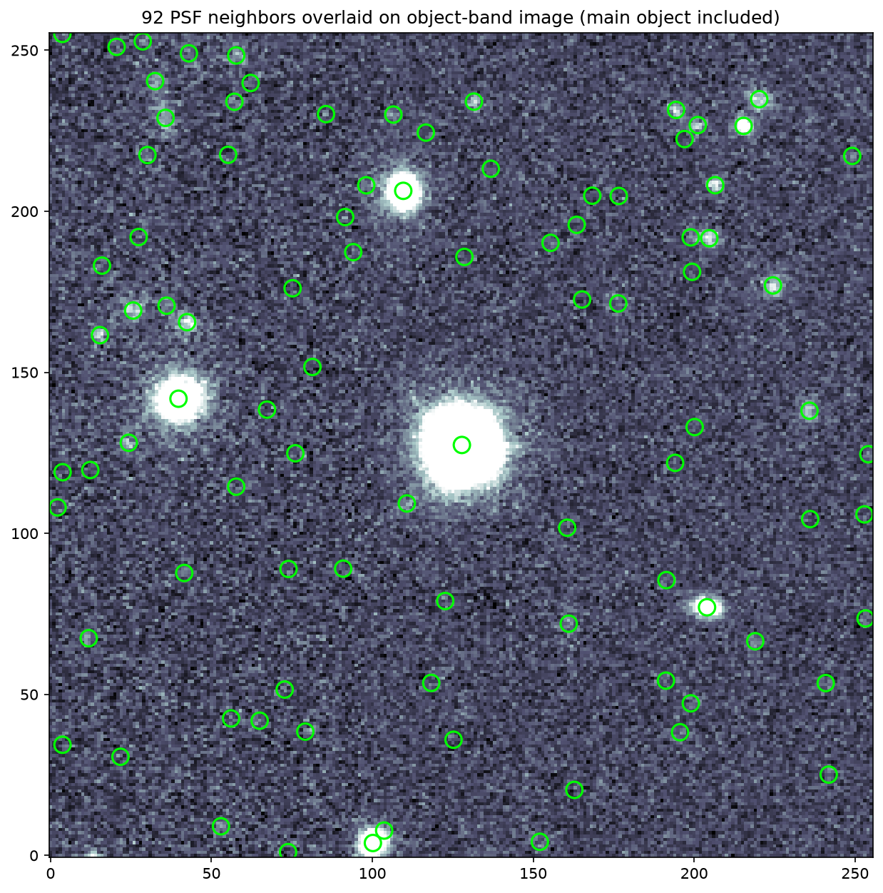
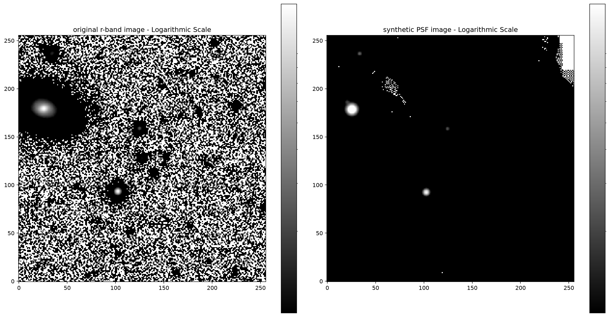
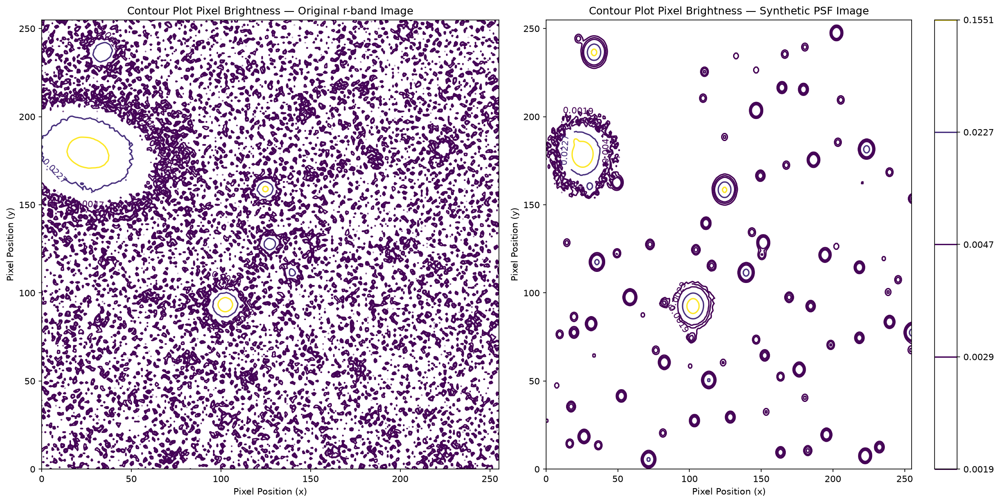
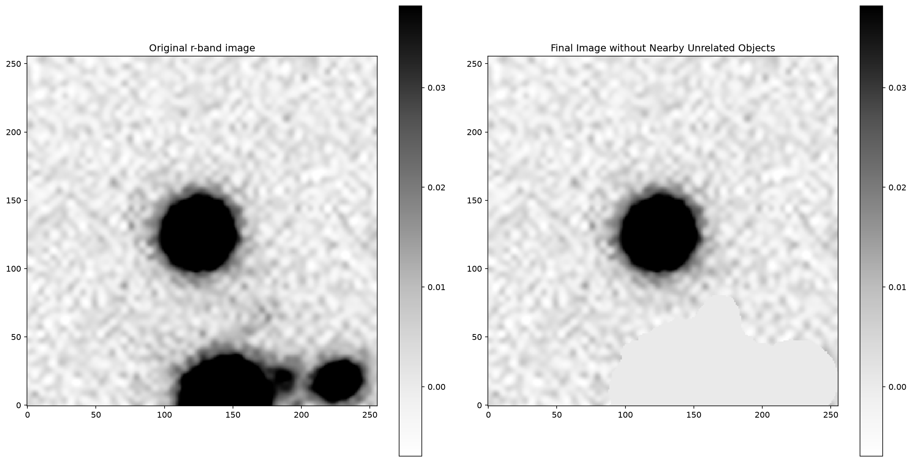
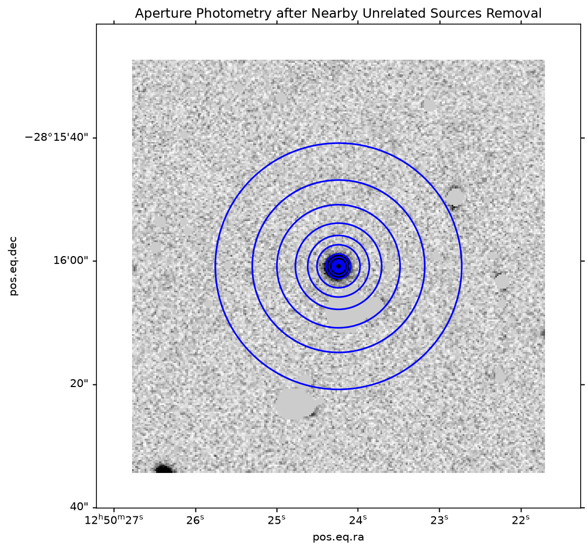
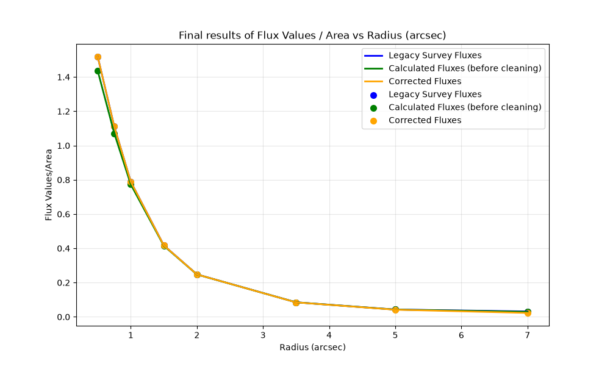
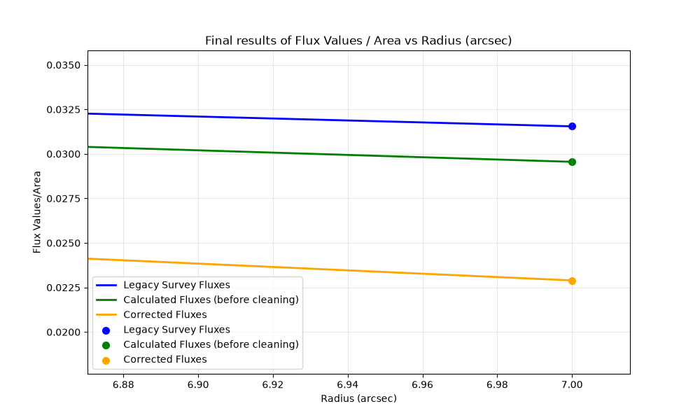

# CleanAp — Clean Aperture Photometry for Legacy Survey Objects

> Automated neighbor subtraction and aperture photometry for any sky object in the DESI Legacy Survey (DR10).

---

## Description

CleanAp is a Python pipeline for performing aperture photometry on sky objects from the DESI Legacy Survey DR10. You give it a sky position (RA, Dec) and a photometric band (g, r, i, or z). It fetches the image cutout, the PSF model, and the source catalog automatically from the Legacy Survey viewer API.

The core problem it solves: bright quasars, galaxies, and stars in the same field contaminate aperture flux measurements. CleanAp identifies every neighboring source in the field, models each one as a scaled PSF stamp, builds a synthetic image of their combined flux, and subtracts that from the real image. The result is a clean image containing only the target's light, on which it then runs multi-radius aperture photometry.

The pipeline was built for quasar host galaxy research — measuring host galaxy fluxes cleanly around a bright central quasar — but works on any Legacy Survey object.

---

## Showcase

All examples use r-band data from DESI Legacy Survey DR10.

**Field source detection** — COSMOS field (RA 150.1191, Dec +2.1956)
All catalog sources identified and overlaid on the image before subtraction.


---

**Original vs synthetic PSF model** — XMM-LSS field (RA 36.4503, Dec -4.6140)
The synthetic image mirrors the neighbor distribution in the real image.


---

**Brightness Contour Plot** — XMM-LSS field (RA 36.4503, Dec -4.6140)
Contour Plot showing Brightness profiles after zoom correction.


---

**Neighbor subtraction result** — (RA 192.6010, Dec -28.2669)
Left: original image with contaminating sources. Right: cleaned image with neighbors removed.


---

**Aperture photometry on cleaned image** — (RA 192.6009, Dec -28.2675)
Concentric apertures from 0.5 to 20 arcsec placed on the cleaned field.


---

### Final Fluxes/Area Results — (RA 192.6009, Dec -28.2675)

Graph showing Final Fluxes/Area plots for Legacy Survey Results, Uncleaned Aperture Photometry, and Final, Deblended Readings (Left), alongside a zoomed-in view of the end of the graph showing lower readings after deblending (Right).

<table border="0">
  <tr>
    <td width="50%" align="center">
      
    </td>
    <td width="50%" align="center">
      
    </td>
  </tr>
</table>
---

**Profile model fits** — Boötes field (RA 213.7052, Dec +53.1234)
Gaussian, Exponential Disk, de Vaucouleurs, and Sersic fits to the measured profile.


## Requirements

```
Python 3.8+
astropy
photutils
numpy
scipy
matplotlib
requests
tabulate
pathlib (standard library)
```

Install dependencies:

```bash
pip install astropy photutils numpy scipy matplotlib requests tabulate
```

or

```bash
pip install -r requirements.txt
```
---

## Usage

Run the notebook cells in order. At the first input prompt, enter your target's coordinates and band:

```
Target Right Ascension: 192.6009
Target Declination: -28.2675
Specific band (griz): r
```

The pipeline fetches all required files automatically. No manual downloads needed.

Accepted band inputs: `g`, `r`, `i`, `z` (with or without `- band` or `_band` suffixes).

---

## Inputs

| Parameter | Type | Description |
|-----------|------|-------------|
| RA | float | Right Ascension in decimal degrees |
| Dec | float | Declination in decimal degrees |
| Band | string | Photometric band: g, r, i, or z |

---

## Outputs

### Per-band FITS file

Saved to `{RA}_{Dec}_output/clean_{RA}_{Dec}_{band}_band.fits`

- HDU 0: Cleaned image + original header + `FLUXCl_{BAND}` keyword containing comma-separated corrected aperture fluxes
- HDU 1: Original uncleaned image

### Master multi-band FITS catalog (optional)

Saved to `{RA}_{Dec}_output/final_table_{RA}_{Dec}.fits`

- HDU 0: Empty primary
- HDU 1 (`FLUX_CATALOG`): Binary table with one column per band (`FLUXCL_G`, `FLUXCL_R`, etc.)
- HDU 2+: Clean and original image extensions for every processed band

### Console output

- Aperture fluxes at 11 radii (0.5 to 20 arcsec)
- Comparison to Legacy Survey catalog fluxes
- Flux per arcsec²
- Magnitude at each aperture
- Azimuthal surface brightness profile
- Best-fit profile parameters (Gaussian, Exponential, de Vaucouleurs, Sersic)

---

## Aperture Radii

All photometry uses these fixed radii, matching the Legacy Survey `apflux` convention:

```
0.5, 0.75, 1.0, 1.5, 2.0, 3.5, 5.0, 7.0, 10.0, 14.0, 20.0 arcsec
```

---

## Key Methods

### PSF amplitude scaling

A reference star is selected from the neighbor catalog. A 1D Gaussian is fitted to its brightness profile in the image to get its background-subtracted peak. This peak divided by the star's catalog flux in nanomaggies gives the amplitude scale factor applied to every synthetic PSF stamp.

### PSF zoom correction

The Legacy Survey PSF model is at 0.262 arcsec/px. If the image cutout has a different effective pixel scale, the widths will not match. The pipeline measures the Gaussian sigma of PSF-type point sources in the image, measures the sigma of the PSF model itself, and zooms the PSF by their ratio before building the synthetic image.

### Main object exclusion

The target is identified in the neighbor catalog using the Haversine formula (great-circle distance). The closest catalog entry to the input RA/Dec is removed from the neighbor list before synthetic image construction. This prevents the pipeline from subtracting the target's own flux.

### Surface brightness

Computed per annulus as:

```
μ = 22.5 - 2.5 × log10(flux / area_arcsec²)   [mag/arcsec²]
```

---

## Plots Produced

1. Original band image (ZScale, gray)
2. PSF model (hot colormap)
3. WCS verification — all catalog sources overlaid on image
4. Original vs synthetic image (log and linear scale)
5. Brightness Profile Comparison — original vs synthetic (zoom calibration check)
6. Contour Plot — original and synthetic image
7. Aperture prediction on binary mask image
8. Aperture photometry on original image (verification)
9. Final aperture photometry on cleaned image
10. Final Results Comparison between original fluxes and fluxes/area
11. Surface brightness profile fits (Gaussian, Exponential Disk, de Vaucouleurs, Sersic)

---

## Data Source

All data fetched from the [DESI Legacy Survey DR10](https://www.legacysurvey.org/):

- Image cutout: `legacysurvey.org/viewer/cutout.fits`
- PSF model: `legacysurvey.org/viewer/coadd-psf/`
- Source catalog: `legacysurvey.org/viewer/ls-dr10/cat.fits`

---

## Notes

- The neighbor catalog search box is asymmetric by default (wider in RA than Dec). Adjust `ra_subtract`, `ra_add`, `dec_subtract`, `dec_add` in the webscraping cell to change the search area.
- Neighbors with zero or negative catalog flux are skipped during synthetic image construction.
- Over-subtracted apertures (negative flux after cleaning) are flagged and excluded from the output table.
- The pipeline prompts before merging multi-band outputs. Run it once per band, then merge.
- Files locked by Jupyter or DS3 are automatically renamed with an incrementing suffix to avoid write errors on Windows.